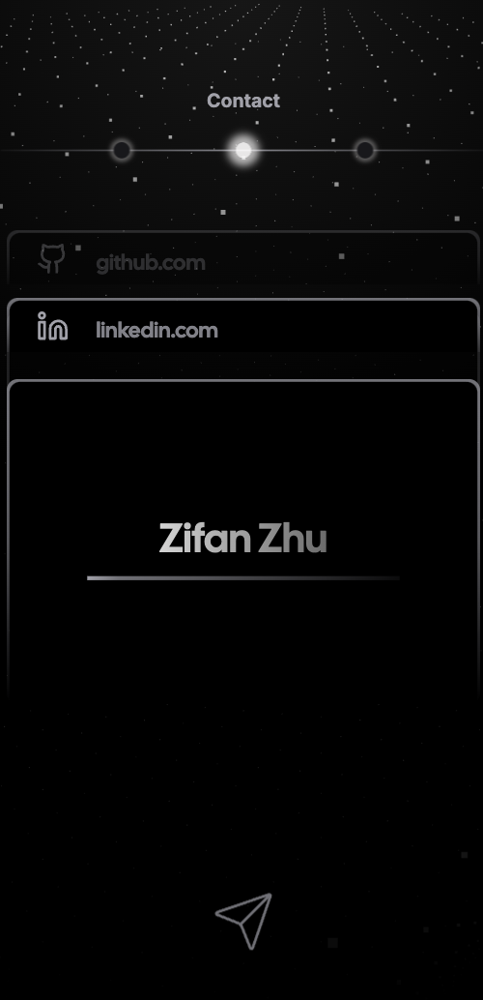

# Some Examples

## Personal Website

- My personal website

  - **[Click to check](https://www.dogeggz.me)**

  - home page
    

  - about page
    

  - projects page
    

  - contact page
    

  

    
    
    
    
  

## In Progress

- A client relationship management system for learning and practice

  - auth page
    

  - an example page
    

  - sidebar editing
    

## Two School Works

- Autodo

  - screen shots from page 20 [autodo project report](./Autodo.pdf)

- Sotock Services Platform
  - chart
    
  - sort
    
  - filter
    
